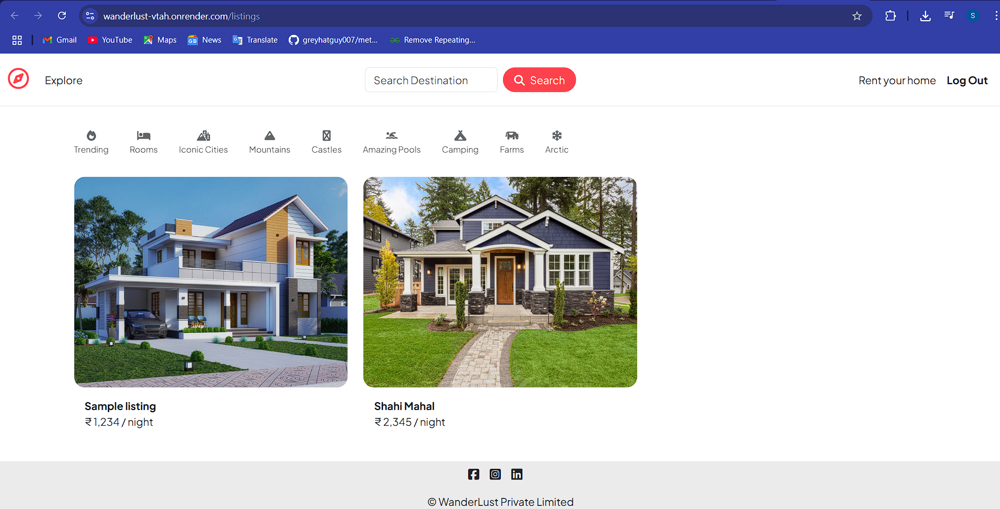
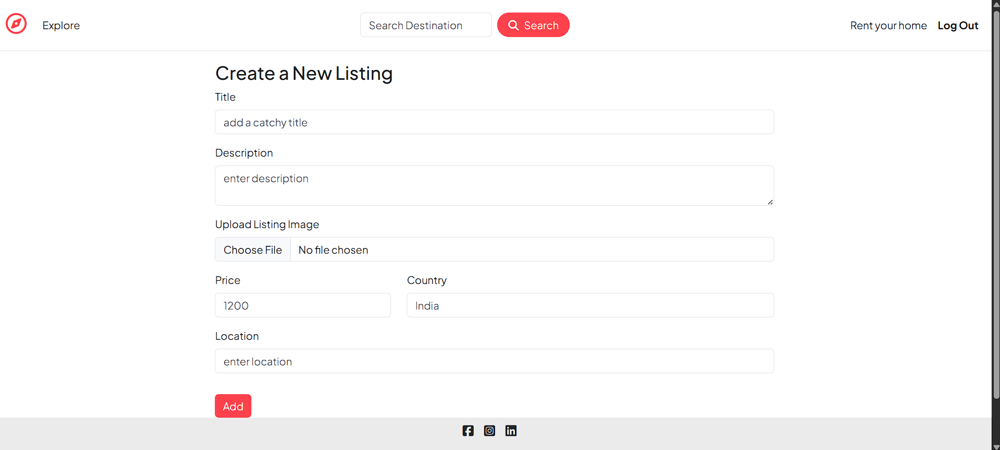
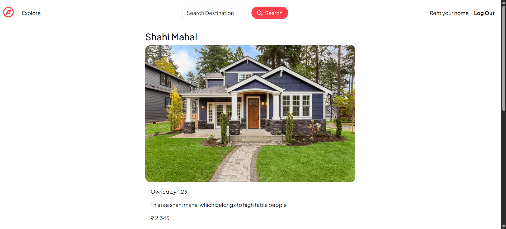
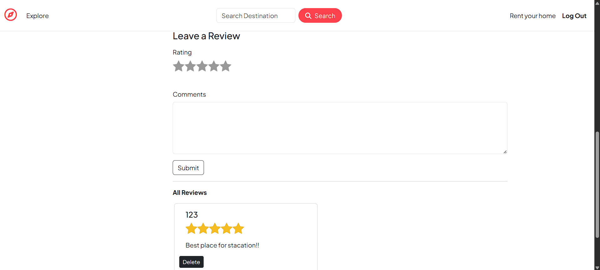

# 🌍 Wanderlust

A **full-stack travel listing web application** that allows users to explore, create, edit, and manage travel destinations and accommodations. Built with **Node.js, Express.js, MongoDB, and EJS**, Wanderlust provides a seamless experience for travelers and hosts alike.

🔗 **Live Demo:** [wanderlust-vtah.onrender.com/listings](https://wanderlust-vtah.onrender.com/listings)

---

## ✨ Features

- 🧭 Browse all travel/accommodation listings
- ✍️ Add, edit, and delete your own listings
- 📱 Fully responsive UI for mobile and desktop
- 🔐 Secure authentication & authorization (middleware included)
- 🌐 RESTful API design with MVC architecture
- ☁️ Cloudinary integration for image storage

---

## 🖼 Website Screenshots

### 🏠 Homepage


### ➕ Add Listing Page


### 🗂 Listings Overview



---

## 🛠 Tech Stack

| Category     | Technologies Used                 |
|--------------|-----------------------------------|
| Backend      | Node.js, Express.js               |
| Frontend     | EJS Templates, HTML, CSS          |
| Database     | MongoDB (via Mongoose)            |
| Authentication | Express Sessions, Passport (Optional setup) |
| Storage      | Cloudinary (configured via `cloudConfig.js`) |
| Architecture | MVC Pattern                       |

---

## 🗂 Project Structure

```
Wanderlust/
├── controllers/       # Application logic
├── models/            # Mongoose schemas/models
├── routes/            # Express route handlers
├── utils/             # Utility functions/helpers
├── views/             # EJS template files
├── public/            # Static assets (CSS, JS, images)
├── app.js             # Entry point
├── schema.js          # Mongoose validation schemas
├── middleware.js      # Custom middleware
├── cloudConfig.js     # Cloudinary configuration
└── package.json       # Project metadata
```

---

## 🚀 Installation

### 1️⃣ Clone the repository
```bash
git clone https://github.com/Siddhesh1732/Wanderlust.git
cd Wanderlust
```

### 2️⃣ Install dependencies
```bash
npm install
```

### 3️⃣ Configure environment variables
- Copy `.env.example` to `.env`
- Fill in your MongoDB URI and Cloudinary credentials

### 4️⃣ Run the development server
```bash
npm start
```

- Visit [http://localhost:3000/listings](http://localhost:3000/listings) in your browser.

---

## 🧪 Usage

- Register or log in to your account
- Add new travel or accommodation listings
- Edit or delete your listings anytime
- Explore and view listings added by others

---

## 🤝 Contributing

We welcome all contributions! Here's how you can help:

1. Fork this repository
2. Create a new branch (`git checkout -b feature/YourFeature`)
3. Commit your changes (`git commit -m 'Add Your Feature'`)
4. Push to the branch (`git push origin feature/YourFeature`)
5. Open a Pull Request

---

## 🪪 License

This project is licensed under the **MIT License**.

---

## 📊 Languages Used

- **JavaScript:** 49%
- **EJS:** 27.5%
- **CSS:** 23.5%

---

## 📬 Contact

For issues, ideas, or feedback, feel free to [open an issue](https://github.com/Siddhesh1732/Wanderlust/issues).

---

> 🌟 *"Happy exploring and contributing!"*
